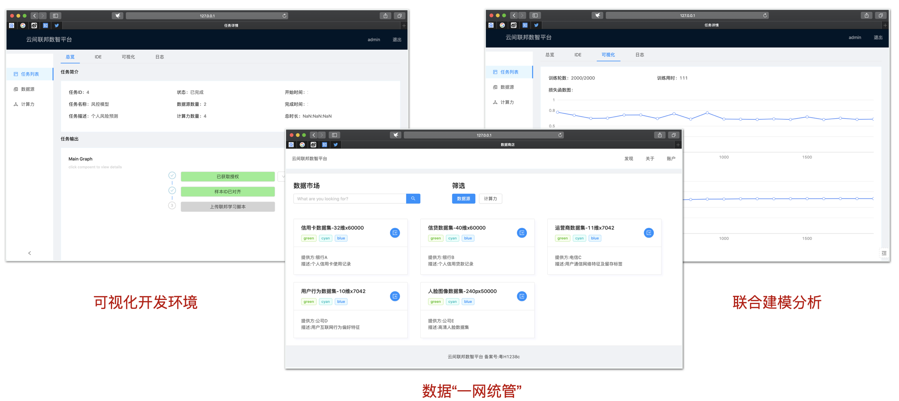
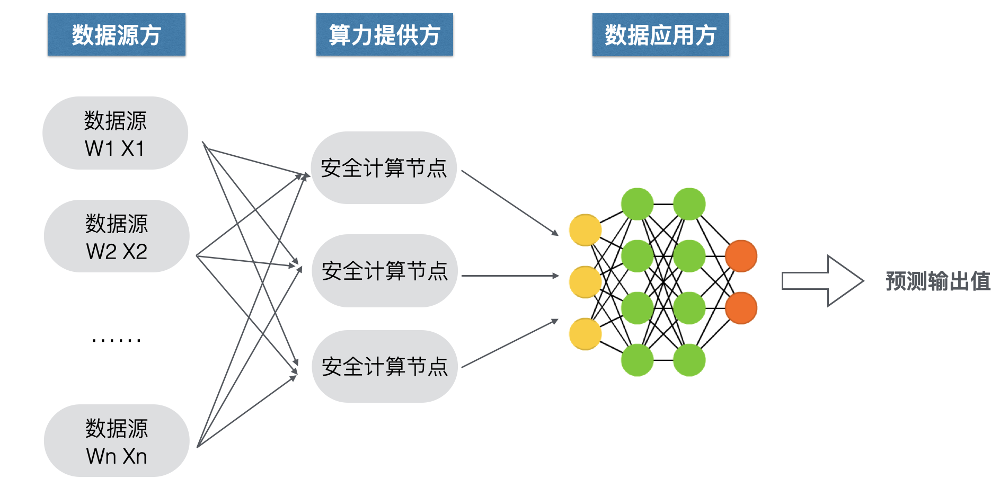
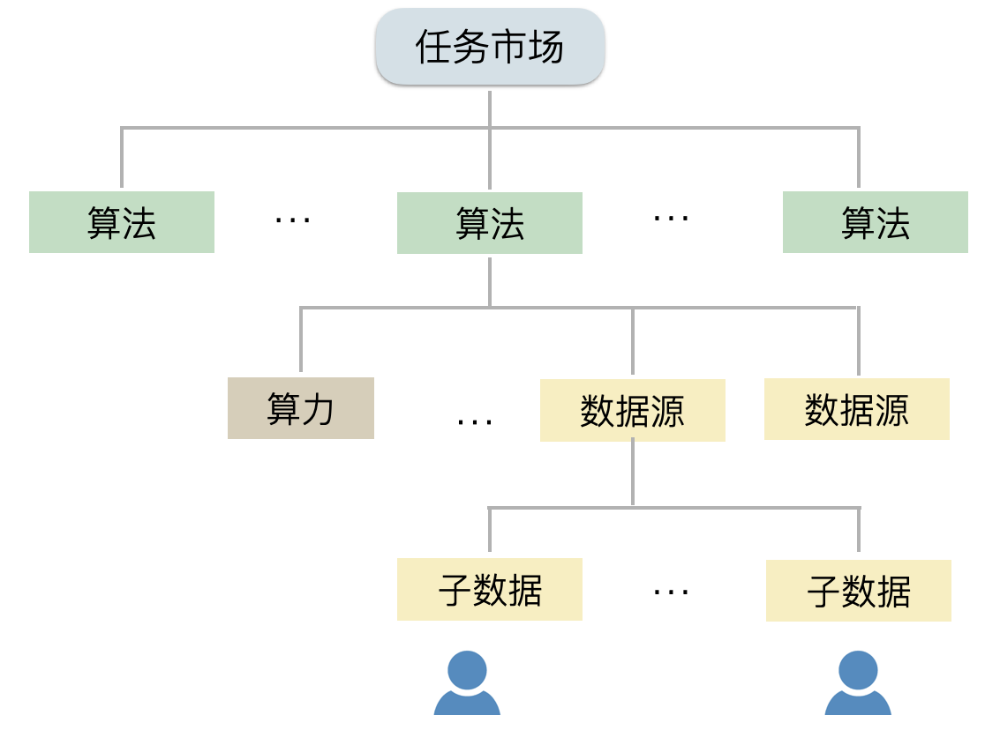

# 区块链数智协作平台助力北外滩建设

## 项目介绍

数据是新基建的核心要素，数据融合共享将持续带来诸多的创新用例。在IOT、5G等技术背景下，连接全域数据并实现数据资源的“一网统管”是当前企业间、部门间亟需创新改进的领域。然而，在目前的监管合规要求下，企业出于用户数据的隐私考虑或是商业利益考虑，通常不愿意将数据资产对外开放共享。

本项目旨在利用隐私计算和区块链等技术，在保证企业数据不出私域的情况下，实现数据的安全融合计算。项目定位为应用层中间件，构建开放数据集市场，并提供对业务人员、数据科学家友好易用的多方数据协作软件。底层使用了Ocean、Platon(rosetta)、TF(encrpyted)等基础协议。同时，我们提出了两个创新点，即共享特征学习和可组合数据通证。

## 共享特征学习

## 可组合数据通证

 

## 潜在应用场景

## Qtum Special Topic
